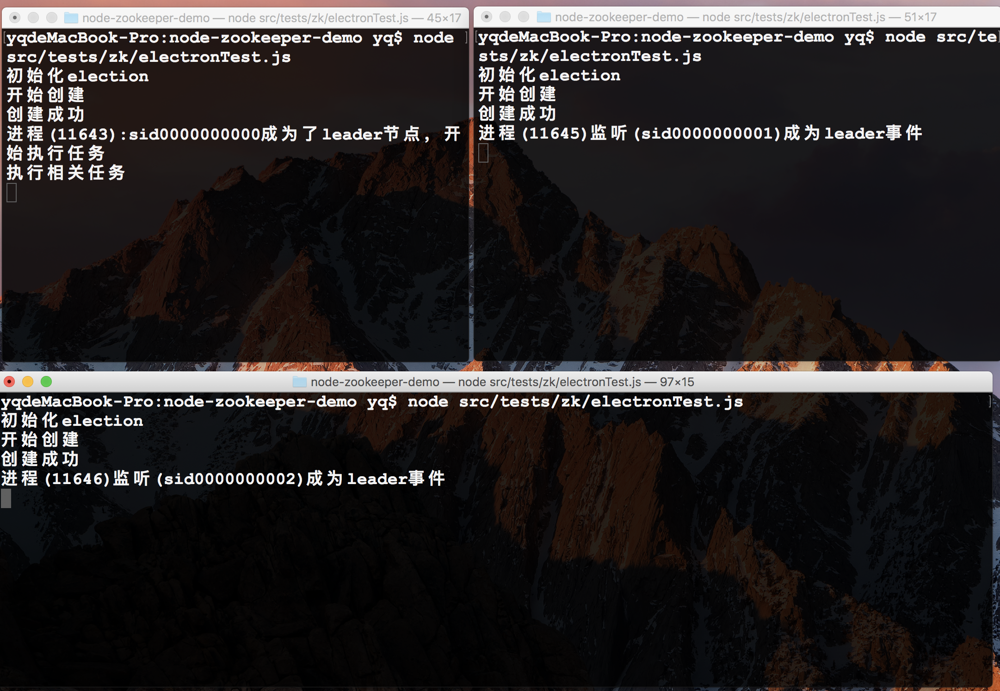

# node-zk-thrift

> nodejs zookeeper thrift高可用服务，持续迭代中
> zookeeper客户端支持断线重连，已在我们公司大规模应用于生产环境中

## 启动脚本

``` bash
# install dependencies
npm install

# 进行相关的测试：例：分别在多个窗口中执行命令 `node src/tests/zk/election.js`,杀死leader进程，新的leader便会诞生
```


## 需求配置
* node >= `^8.9.0`
* npm >= `^5.0.0`


## 程序目录

```
.
├── src                      # 程序源文件
|    ├── config              # 系统配置文件
|       |── log              # log4js日志配置文件
│       |── dev              # 开发环境配置
│       |── index            # 配置文件入口及不区分环境变量的系统配置
│       |── prod             # 生产环境配置
│       └── test             # 测试环境配置文件
│   ├── lib                  # 自定义扩展组件，如dom动态注入script脚本的js组件
|       |── zk               # zookeeper 相关封装类
│         |── election.js    # zookeeper选举封装类
│         |── zkClient       # zookeeper 客户端封装类，支持断线重连
│         └── zkLock         # zookeeper分布式队列锁获取方法
│   ├── test                 # 测试脚本目录
|        |── zk              # zookeeper相关测试文件
|           |── electionTest.js            # 选举测试文件
└           └── zkLockTest                 # 分布式队列锁获取方法
```

## 屏幕截图


